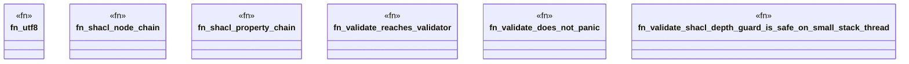

# `crates/ggen-engine/tests/validate_hardening_test.rs`

Source SHA-256: `ff53eaa4dd726b95c3a9e2584d567138d6708fa75e154c3ce1b3553deea7bc83`

## Dependencies

- `camino::Utf8PathBuf`
- `ggen_engine::verbs::handlers::handle_graph_validate`
- `tempfile::TempDir`

## Standing

- Structural parse: `ALIVE`
- Runtime behavior: `UNKNOWN`
