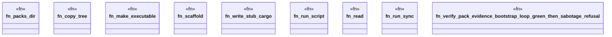

# `crates/ggen-engine/tests/verify_pack_evidence_loop_e2e.rs`

Source SHA-256: `f7ad86936fbd830c8dea75986e869fe8ddd196b21c8c71d0439a987a386c726f`

## Dependencies

- `ggen_engine::sync::{sync, SyncOptions}`
- `std::os::unix::fs::PermissionsExt`
- `std::path::{Path, PathBuf}`
- `std::process::Command`
- `tempfile::TempDir`

## Standing

- Structural parse: `ALIVE`
- Runtime behavior: `UNKNOWN`
