# `crates/ggen-engine/tests/verify_pack_gate_sabotage_e2e.rs`

Source SHA-256: `0bfcaea74c9088702dc8411e6b94473230ca5e0b75ac9d62873045abfc5e28e1`

```mermaid
classDiagram
    class fn_packs_dir {
      <<fn>>
    }
    class fn_copy_tree {
      <<fn>>
    }
    class fn_scaffold {
      <<fn>>
    }
    class fn_green_required_checks_ttl {
      <<fn>>
    }
    class fn_write_ontology {
      <<fn>>
    }
    class fn_write_ontology_with_stale_check {
      <<fn>>
    }
    class fn_run_sync {
      <<fn>>
    }
    class fn_read_log_lines {
      <<fn>>
    }
    class fn_evidence_fresh_gate_passes_when_no_verified_hash_is_recorded {
      <<fn>>
    }
    class fn_evidence_fresh_gate_refuses_stale_verified_hash_against_latest_sync {
      <<fn>>
    }
    class fn_evidence_fresh_gate_passes_when_verified_hash_matches_latest_sync {
      <<fn>>
    }
    class fn_latest_andon_green_gate_passes_on_a_healthy_chain {
      <<fn>>
    }
    class fn_latest_andon_green_gate_refuses_a_forged_non_green_latest_sync {
      <<fn>>
    }
    class fn_output_count_regression_gate_passes_when_output_count_grows {
      <<fn>>
    }
    class fn_output_count_regression_gate_refuses_a_real_output_shrink {
      <<fn>>
    }
    class fn_output_count_regression_gate_accepted_shrink_is_hash_specific_not_a_blanket_bypass {
      <<fn>>
    }
```

## Dependencies

- `ggen_engine::sync::{sync, SyncOptions, SyncReceipt, RECEIPT_LOG_REL_PATH}`
- `praxis_core::law::Andon`
- `std::path::{Path, PathBuf}`
- `tempfile::TempDir`

## Standing

- Structural parse: `ALIVE`
- Runtime behavior: `UNKNOWN`
