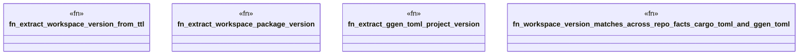

# `crates/ggen-engine/tests/version_consistency_e2e.rs`

Source SHA-256: `00c374f6e79a879792656fbbfe15ff6a341e6d0a4a2b17ef33493bc00b93fb80`

## Dependencies

- None observed.

## Standing

- Structural parse: `ALIVE`
- Runtime behavior: `UNKNOWN`
