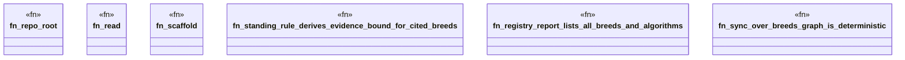

# `crates/ggen-engine/tests/wasm4pm_facts_e2e.rs`

Source SHA-256: `e8a2e6889bb5889bbd7cee835e926a2f635d7208915094b918e06548024e2e3c`

## Dependencies

- `ggen_engine::graph::{GraphEngine as _, GraphLawStore}`
- `ggen_engine::sync::{sync, SyncOptions}`
- `std::path::{Path, PathBuf}`
- `tempfile::TempDir`

## Standing

- Structural parse: `ALIVE`
- Runtime behavior: `UNKNOWN`
