# `crates/ggen-engine/tests/write_behaviors_cli_e2e.rs`

Source SHA-256: `234c02a7c087e8f29cadd4dce3d4c2503eb98bc3ff0cba4a98aa21fcccc03c61`

```mermaid
classDiagram
    class fn_scaffold {
      <<fn>>
    }
    class fn_write_template {
      <<fn>>
    }
    class fn_run_sync {
      <<fn>>
    }
    class fn_to_path_escaping_the_project_root_is_refused {
      <<fn>>
    }
    class fn_unless_exists_skips_a_file_that_already_exists {
      <<fn>>
    }
    class fn_skip_if_skips_when_the_marker_is_already_present {
      <<fn>>
    }
    class fn_freeze_always_skips_once_the_target_exists {
      <<fn>>
    }
    class fn_freeze_checksum_regenerates_until_a_human_edits_it_then_protects_it {
      <<fn>>
    }
    class fn_inject_before_marker_inserts_content_and_backs_up_first {
      <<fn>>
    }
    class fn_inject_into_a_missing_target_is_refused {
      <<fn>>
    }
    class fn_inject_with_a_missing_marker_is_refused {
      <<fn>>
    }
    class fn_force_overwrites_differing_content_and_backs_up_first {
      <<fn>>
    }
    class fn_default_semantics_write_then_skip_then_refuse_on_drift {
      <<fn>>
    }
    class fn_oversized_rendered_output_is_refused_over_the_cli_boundary {
      <<fn>>
    }
    class fn_a_render_failure_in_one_template_leaves_no_writes_from_others_over_the_cli_boundary {
      <<fn>>
    }
```

## Dependencies

- `chicago_tdd_tools::cli_proof::CliHarness`
- `std::path::Path`
- `tempfile::TempDir`

## Standing

- Structural parse: `ALIVE`
- Runtime behavior: `UNKNOWN`
