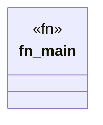

# `crates/ggen-graph/src/bin/emit_audit.rs`

Source SHA-256: `3c0c79fb3b775a33180cf43f38bc753b32d7ac9284f15e953fb278bb65d4e9ff`

## Dependencies

- `ggen_graph::ocel::{generate_coverage_matrix, generate_self_audit_log}`
- `std::fs::{self, File}`
- `std::io::BufWriter`
- `std::path::Path`

## Standing

- Structural parse: `ALIVE`
- Runtime behavior: `UNKNOWN`
