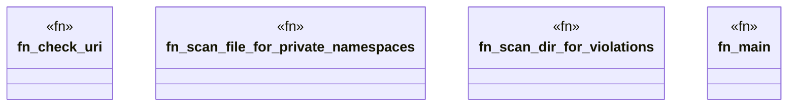

# `crates/ggen-graph/src/bin/gall_actuate_code_evaluation.rs`

Source SHA-256: `fe72c7cba2f12fac4191de041c9129171051e0976dd40e0389ef832a5e2f833b`

## Dependencies

- `chrono::Utc`
- `ggen_graph::graph::serialize::serialize_to_string`
- `oxigraph::io::{RdfFormat, RdfParser}`
- `oxigraph::model::{BlankNode, GraphName, Literal, NamedNode, NamedOrBlankNode, Quad, Term}`
- `oxigraph::store::Store`
- `std::fs::File`
- `std::io::Read`
- `std::path::{Path, PathBuf}`

## Standing

- Structural parse: `ALIVE`
- Runtime behavior: `UNKNOWN`
