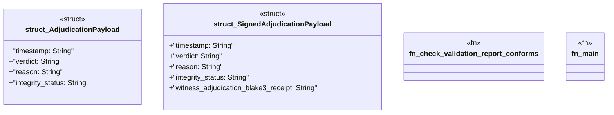

# `crates/ggen-graph/src/bin/gall_adjudicate_witnessed_truthfulness.rs`

Source SHA-256: `2e73471a8254d9b08567d0ca464923c5a5c98517b75e0a504a071e6da5f7db47`

## Dependencies

- `chrono::Utc`
- `oxigraph::io::{RdfFormat, RdfParser}`
- `oxigraph::model::Term`
- `oxigraph::store::Store`
- `serde::{Deserialize, Serialize}`
- `std::fs::File`

## Standing

- Structural parse: `ALIVE`
- Runtime behavior: `UNKNOWN`
