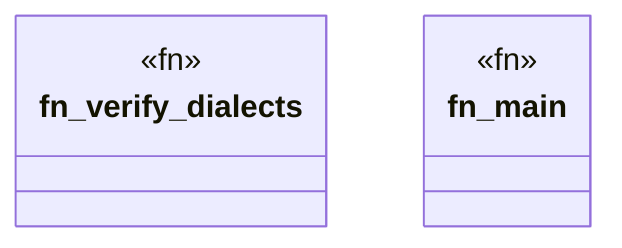

# `crates/ggen-graph/src/bin/gall_materialize_evidence_graph.rs`

Source SHA-256: `e6a525d0c29b375fab3e9913b9a1ad7d365eb7fe7764ba39488336446cded2af`

## Dependencies

- `chrono::Utc`
- `ggen_graph::dialect::{check_datalog, check_n3, check_shacl, check_shex, check_sparql}`
- `ggen_graph::graph::parse::parse_turtle`
- `ggen_graph::graph::serialize::serialize_to_string`
- `ggen_graph::ocel::{OcelEvent, OcelLog, OcelObject, OcelObjectRef}`
- `oxigraph::io::RdfFormat`
- `std::collections::HashMap`
- `std::fs::File`
- `std::io::Read`
- `std::path::Path`

## Standing

- Structural parse: `ALIVE`
- Runtime behavior: `UNKNOWN`
