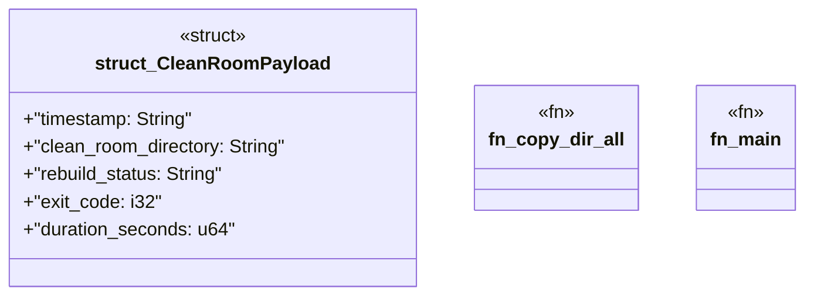

# `crates/ggen-graph/src/bin/gall_observe_clean_room.rs`

Source SHA-256: `399a079ea9759a4b45e92fec01cdd47ad2e5ce9e600b356e7333210de6346108`

## Dependencies

- `chrono::Utc`
- `oxigraph::io::{RdfFormat, RdfParser}`
- `oxigraph::model::Term`
- `oxigraph::sparql::QueryResults`
- `oxigraph::store::Store`
- `serde::{Deserialize, Serialize}`
- `std::fs::{copy, create_dir_all, read_dir, File}`
- `std::path::Path`
- `std::process::Command`
- `std::time::Instant`

## Standing

- Structural parse: `ALIVE`
- Runtime behavior: `UNKNOWN`
