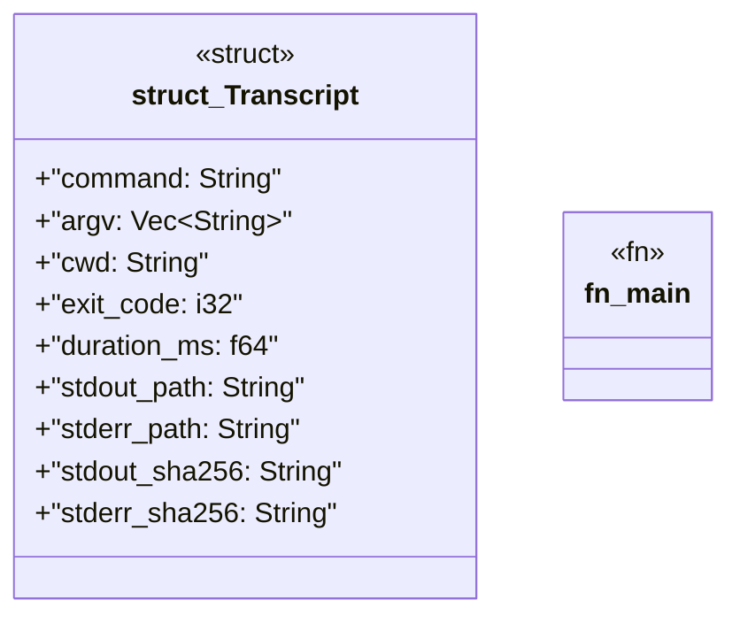

# `crates/ggen-graph/src/bin/gall_observe_commands.rs`

Source SHA-256: `65a50c209c91577a25734eb36266debab99dd5259cb7b89708207bf2fe1f8055`

## Dependencies

- `chrono::Utc`
- `oxigraph::io::{RdfFormat, RdfParser}`
- `oxigraph::model::Term`
- `oxigraph::sparql::QueryResults`
- `oxigraph::store::Store`
- `serde::{Deserialize, Serialize}`
- `sha2::{Digest, Sha256}`
- `std::fs::File`
- `std::process::Command`

## Standing

- Structural parse: `ALIVE`
- Runtime behavior: `UNKNOWN`
