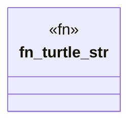

# `crates/ggen-graph/src/bin/gall_observe_docs_tree.rs`

Source SHA-256: `044194a0869bd880ffd7ead993bbf4c2bbae2d72e4d70a9108c6f5951aaad9d2`

## Dependencies

- `serde::{Deserialize, Serialize}`
- `sha2::{Digest, Sha256}`
- `std::fs::File`
- `std::io::Read`
- `std::path::{Path, PathBuf}`

## Standing

- Structural parse: `ALIVE`
- Runtime behavior: `UNKNOWN`
