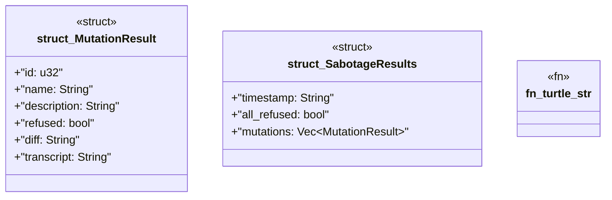

# `crates/ggen-graph/src/bin/gall_observe_sabotage.rs`

Source SHA-256: `f092d6e8183f02b20c4ce76fb172f6969b8aec77af29cf1cb3f98f3bdd789e2f`

## Dependencies

- `chrono::Utc`
- `oxigraph::io::{RdfFormat, RdfParser}`
- `oxigraph::model::Term`
- `oxigraph::store::Store`
- `serde::{Deserialize, Serialize}`
- `std::fs::{copy, create_dir_all, read_dir, File}`
- `std::io::Read`
- `std::path::{Path, PathBuf}`
- `std::process::Command`

## Standing

- Structural parse: `ALIVE`
- Runtime behavior: `UNKNOWN`
