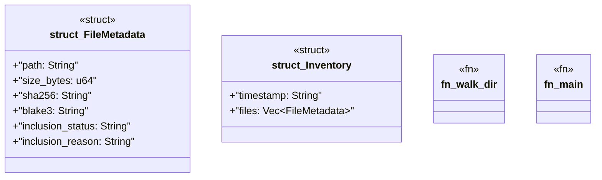

# `crates/ggen-graph/src/bin/gall_observe_worktree.rs`

Source SHA-256: `f5053df648419f1dc1ec7ebaffd30c7e2dd11e45380df5daacbc974c8192418d`

## Dependencies

- `chrono::Utc`
- `serde::{Deserialize, Serialize}`
- `sha2::{Digest, Sha256}`
- `std::fs::File`
- `std::io::Read`
- `std::path::Path`

## Standing

- Structural parse: `ALIVE`
- Runtime behavior: `UNKNOWN`
