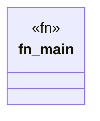

# `crates/ggen-graph/src/bin/verify_audit.rs`

Source SHA-256: `9921b0ee3e1ffa2aae5743ca5d70a711cc69e007ca6bc47f85b896dd2b3aec7e`

## Dependencies

- `ggen_graph::ocel::{CoverageMatrix, OcelLog}`
- `std::fs::File`
- `std::io::BufReader`
- `std::path::Path`

## Standing

- Structural parse: `ALIVE`
- Runtime behavior: `UNKNOWN`
