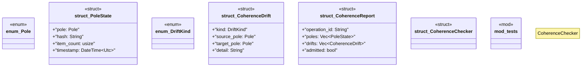

# `crates/ggen-graph/src/coherence.rs`

Source SHA-256: `96c32576e1ba798792566c53c2581448405702b6adf36bcb2eb969e497a9febb`

## Dependencies

- `chrono::{DateTime, Utc}`
- `serde::{Deserialize, Serialize}`
- `std::collections::HashMap`
- `super::*`
- `uuid::Uuid`

## Standing

- Structural parse: `ALIVE`
- Runtime behavior: `UNKNOWN`
