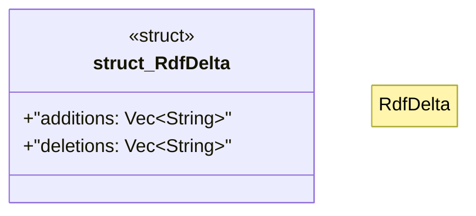

# `crates/ggen-graph/src/delta/mod.rs`

Source SHA-256: `df89011e4a9e8126c2053fedd01c955e94e0fca182ab962933c7a498660badb3`

## Dependencies

- `crate::GraphError`
- `crate::graph::DeterministicGraph`
- `crate::graph::hash::hash_delta`
- `serde::{Deserialize, Serialize}`

## Standing

- Structural parse: `ALIVE`
- Runtime behavior: `UNKNOWN`
