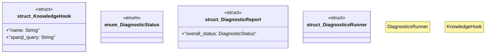

# `crates/ggen-graph/src/diagnostics/mod.rs`

Source SHA-256: `1070d7a1fdbacc60beac9a05deec64edf8596826f1f1efcd6233a2dbc9d60087`

## Dependencies

- `crate::GraphError`
- `crate::graph::DeterministicGraph`
- `serde::{Deserialize, Serialize}`

## Standing

- Structural parse: `ALIVE`
- Runtime behavior: `UNKNOWN`
