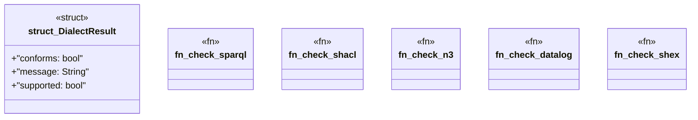

# `crates/ggen-graph/src/dialect.rs`

Source SHA-256: `b13aa1f3ae8a56fc0f4a7f11db56c20a3ef49b9dd382c7e07b92c753dfd89c45`

## Dependencies

- `oxigraph::io::{RdfFormat, RdfParser}`
- `oxigraph::model::Term`
- `oxigraph::sparql::QueryResults`
- `oxigraph::store::Store`
- `serde::{Deserialize, Serialize}`

## Standing

- Structural parse: `ALIVE`
- Runtime behavior: `UNKNOWN`
