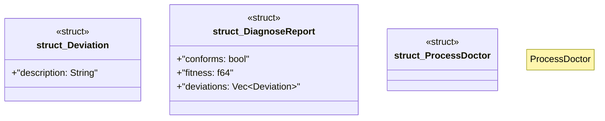

# `crates/ggen-graph/src/doctor/mod.rs`

Source SHA-256: `92edc8ca2d2077eb5d32510c6209a7a8428313494298dc43029dc783ec753f67`

## Dependencies

- `crate::GraphError`
- `crate::graph::DeterministicGraph`

## Standing

- Structural parse: `ALIVE`
- Runtime behavior: `UNKNOWN`
