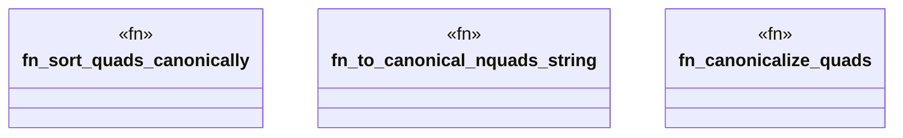

# `crates/ggen-graph/src/graph/canonical.rs`

Source SHA-256: `78135c7babdba63f23d0bb266b425fa36300dbdf4f4c739a8f66cf45748feb7e`

## Dependencies

- `oxigraph::model::{BlankNode, GraphName, NamedOrBlankNode, Quad, Term}`
- `std::collections::{HashMap, HashSet}`

## Standing

- Structural parse: `ALIVE`
- Runtime behavior: `UNKNOWN`
