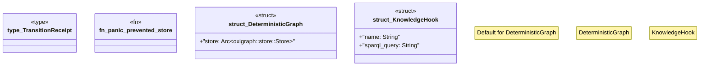

# `crates/ggen-graph/src/graph/dataset.rs`

Source SHA-256: `9c56cfd111f74cc4e10f1c8f3ec0037d060fc0f45535569935b1aa9c423e67bd`

## Dependencies

- `crate::GraphError`
- `crate::delta::RdfDelta`
- `crate::graph::hash::hash_quads`
- `crate::graph::quad::parse_nquad`
- `crate::receipt::GraphReceipt`
- `oxigraph::model::Quad`
- `std::sync::Arc`

## Standing

- Structural parse: `ALIVE`
- Runtime behavior: `UNKNOWN`
