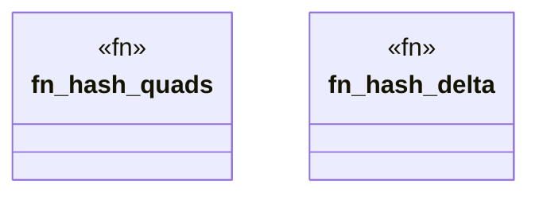

# `crates/ggen-graph/src/graph/hash.rs`

Source SHA-256: `5369e7d09d08fb0ac907840026fd83a41b757ef3e0a2053d833656cc69b58570`

## Dependencies

- `oxigraph::model::Quad`

## Standing

- Structural parse: `ALIVE`
- Runtime behavior: `UNKNOWN`
