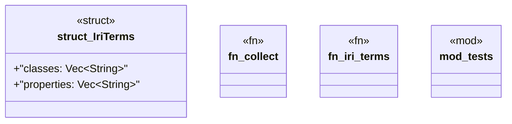

# `crates/ggen-graph/src/graph/introspect.rs`

Source SHA-256: `8f5db3730e7af0a52a6a400a1c78bd135912ee521c0218160d824518f77ca0d3`

## Dependencies

- `crate::GraphError`
- `crate::graph::DeterministicGraph`
- `crate::graph::parse::parse_turtle`
- `oxigraph::model::Term`
- `oxigraph::sparql::QueryResults`
- `super::*`

## Standing

- Structural parse: `ALIVE`
- Runtime behavior: `UNKNOWN`
