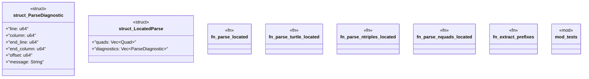

# `crates/ggen-graph/src/graph/locate.rs`

Source SHA-256: `405e0783587ac230a244e3904fe2bd1794c9ef9a596f55e3dafa6059ac1792e6`

## Dependencies

- `oxigraph::io::{RdfFormat, RdfParser}`
- `oxigraph::model::Quad`
- `super::*`

## Standing

- Structural parse: `ALIVE`
- Runtime behavior: `UNKNOWN`
