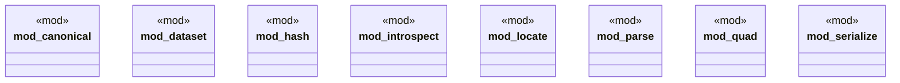

# `crates/ggen-graph/src/graph/mod.rs`

Source SHA-256: `5076afd42f9da0491036f1729afc539f394759ed10c2d09a724ce6d1b096b4fe`

## Dependencies

- `crate::delta::RdfDelta`
- `dataset::{DeterministicGraph, KnowledgeHook, TransitionReceipt}`
- `introspect::{iri_terms, IriTerms}`
- `locate::{ extract_prefixes, parse_nquads_located, parse_ntriples_located, parse_turtle_located, LocatedParse, ParseDiagnostic, }`
- `quad::{parse_nquad, QuadBuilder}`

## Standing

- Structural parse: `ALIVE`
- Runtime behavior: `UNKNOWN`
