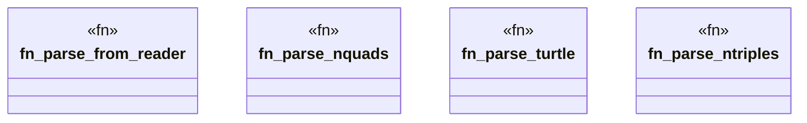

# `crates/ggen-graph/src/graph/parse.rs`

Source SHA-256: `0177f5d488f0e799ed30e50cee3ce3db1633c82f57826a0ab60f783c2cfee3dd`

## Dependencies

- `crate::GraphError`
- `oxigraph::io::{RdfFormat, RdfParser}`
- `oxigraph::model::Quad`
- `std::io::Read`

## Standing

- Structural parse: `ALIVE`
- Runtime behavior: `UNKNOWN`
