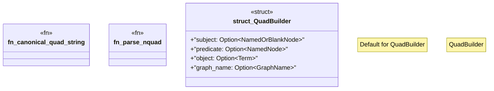

# `crates/ggen-graph/src/graph/quad.rs`

Source SHA-256: `c6939e13fd4eae9d62200d09967f968513ff1c109456daa7eba34284302443bd`

## Dependencies

- `crate::GraphError`
- `oxigraph::model::{GraphName, NamedNode, NamedOrBlankNode, Quad, Term}`

## Standing

- Structural parse: `ALIVE`
- Runtime behavior: `UNKNOWN`
