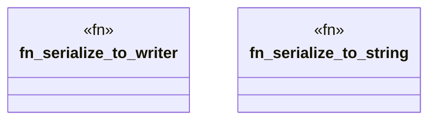

# `crates/ggen-graph/src/graph/serialize.rs`

Source SHA-256: `96da85953f14daa8f2978a873d8983cefc23806813571b26ec2273179b1023fb`

## Dependencies

- `crate::GraphError`
- `oxigraph::io::{RdfFormat, RdfSerializer}`
- `oxigraph::model::{GraphNameRef, Quad}`
- `std::io::Write`

## Standing

- Structural parse: `ALIVE`
- Runtime behavior: `UNKNOWN`
