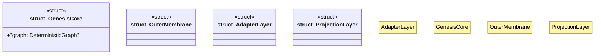

# `crates/ggen-graph/src/interchangeable.rs`

Source SHA-256: `9158d8836a54ecf1fed28c72ec711c05d3f6729c3d96fd49c73c7a8b79c9bc10`

## Dependencies

- `crate::GraphError`
- `crate::delta::RdfDelta`
- `crate::graph::dataset::DeterministicGraph`
- `crate::ocel::{EvidenceProjector, OcelLog}`
- `crate::receipt::GraphReceipt`
- `oxigraph::model::Quad`
- `serde_json::Value`

## Standing

- Structural parse: `ALIVE`
- Runtime behavior: `UNKNOWN`
