# `crates/ggen-graph/src/lib.rs`

Source SHA-256: `1f84cb71265c424f08a3120bc7bdd030e91e46d83a504a119a858c98fa9cbe42`

```mermaid
classDiagram
    class mod_coherence {
      <<mod>>
    }
    class mod_delta {
      <<mod>>
    }
    class mod_diagnostics {
      <<mod>>
    }
    class mod_dialect {
      <<mod>>
    }
    class mod_doctor {
      <<mod>>
    }
    class mod_graph {
      <<mod>>
    }
    class mod_interchangeable {
      <<mod>>
    }
    class mod_ocel {
      <<mod>>
    }
    class mod_prelude {
      <<mod>>
    }
    class mod_receipt {
      <<mod>>
    }
    class mod_rwr {
      <<mod>>
    }
    class mod_shacl {
      <<mod>>
    }
    class mod_sparql {
      <<mod>>
    }
    class mod_vocab {
      <<mod>>
    }
    class enum_GraphError {
      <<enum>>
    }
    class mod_tests {
      <<mod>>
    }
```

## Dependencies

- `coherence::{ CoherenceChecker, CoherenceDrift, CoherenceReport, DriftKind, Pole, PoleState, }`
- `graph::quad::parse_nquad`
- `graph::{ extract_prefixes, iri_terms, parse_nquads_located, parse_ntriples_located, parse_turtle_located, DeterministicGraph, IriTerms, KnowledgeHook, LocatedParse, ParseDiagnostic, RdfDelta, TransitionReceipt, }`
- `interchangeable::{AdapterLayer, GenesisCore, OuterMembrane, ProjectionLayer}`
- `ocel::{check_guard, check_lifecycle_order, discover_dfg, DfgEdge}`
- `shacl::{validate_shacl, ShaclSeverity, ShaclViolation}`
- `sparql::{check_sparql_syntax, sparql_kind, SparqlKind}`
- `super::*`

## Standing

- Structural parse: `ALIVE`
- Runtime behavior: `UNKNOWN`
