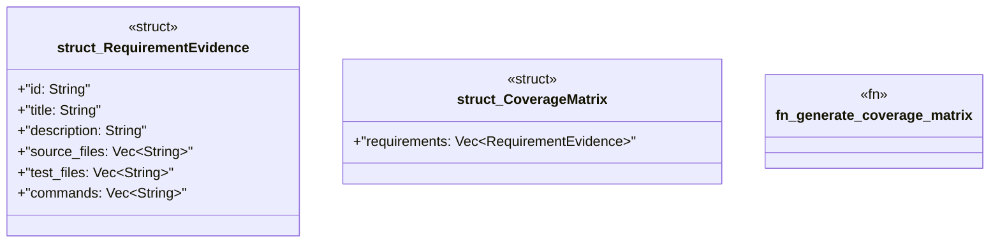

# `crates/ggen-graph/src/ocel/coverage.rs`

Source SHA-256: `11a556ea89eb4ce345c8394ee267868b0ccf3ffc15086bc7ca0c819799ff8460`

## Dependencies

- `serde::{Deserialize, Serialize}`

## Standing

- Structural parse: `ALIVE`
- Runtime behavior: `UNKNOWN`
