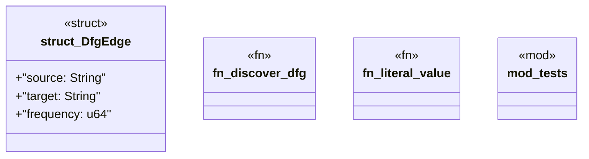

# `crates/ggen-graph/src/ocel/dfg.rs`

Source SHA-256: `9be33731799e717efe072b7e75ad78ca0c7ddd22d403e504f57be98c75b84f46`

## Dependencies

- `chrono::{DateTime, FixedOffset}`
- `chrono::{TimeZone, Utc}`
- `crate::GraphError`
- `crate::graph::DeterministicGraph`
- `crate::ocel::{EvidenceProjector, OcelEvent, OcelLog, OcelObjectRef}`
- `oxigraph::model::Term`
- `oxigraph::sparql::QueryResults`
- `std::collections::BTreeSet`
- `std::collections::HashMap`
- `super::*`
- `wasm4pm_compat::dfg::discover_ocel_dfg`
- `wasm4pm_compat::ocel::{OCELEvent, OCELRelationship, OCELType, OCEL}`

## Standing

- Structural parse: `ALIVE`
- Runtime behavior: `UNKNOWN`
