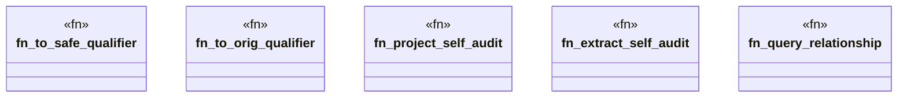

# `crates/ggen-graph/src/ocel/gall_projection.rs`

Source SHA-256: `a264c216ed0fec365b233af9366e2830bc40cdb7ee6f7e21fb9cd07217b35d85`

## Dependencies

- `crate::ocel::{EvidenceProjector, OcelLog}`
- `crate::{DeterministicGraph, GraphError}`

## Standing

- Structural parse: `ALIVE`
- Runtime behavior: `UNKNOWN`
