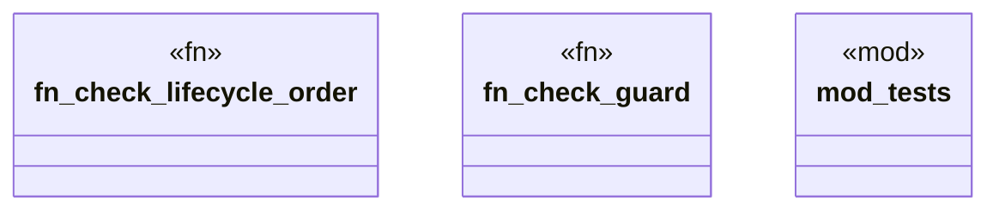

# `crates/ggen-graph/src/ocel/lifecycle.rs`

Source SHA-256: `69d726caaa56f00fecec6a4fe3b8ceb3b8d6dd9177d1a0035d687ff15435cfd6`

## Dependencies

- `chrono::{TimeZone, Utc}`
- `crate::GraphError`
- `crate::graph::DeterministicGraph`
- `crate::ocel::{EvidenceProjector, OcelEvent, OcelLog, OcelObjectRef}`
- `oxigraph::sparql::QueryResults`
- `std::collections::HashMap`
- `super::*`

## Standing

- Structural parse: `ALIVE`
- Runtime behavior: `UNKNOWN`
