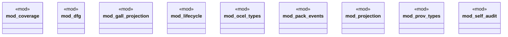

# `crates/ggen-graph/src/ocel/mod.rs`

Source SHA-256: `300159263fc7f27e2321a7a4dddbbbe194a097e7f9ebd281b6a8e988f48e7881`

## Dependencies

- `coverage::{generate_coverage_matrix, CoverageMatrix, RequirementEvidence}`
- `dfg::{discover_dfg, DfgEdge}`
- `gall_projection::{extract_self_audit, project_self_audit, query_relationship}`
- `lifecycle::{check_guard, check_lifecycle_order}`
- `ocel_types::{OcelEvent, OcelLog, OcelObject, OcelObjectRef}`
- `pack_events::{ emit_lockfile_write, emit_pack_install, emit_pack_publish, emit_pack_remove, emit_pack_verify, lockfile_entry_object, lockfile_entry_object_id, pack_object, pack_object_id, receipt_object, receipt_object_id, ACT_LOCKFILE_WRITE, ACT_PACK_INSTALL, ACT_PACK_PUBLISH, ACT_PACK_REMOVE, ACT_PACK_VERIFY, OBJ_TYPE_LOCKFILE_ENTRY, OBJ_TYPE_PACK, OBJ_TYPE_RECEIPT, }`
- `projection::EvidenceProjector`
- `prov_types::{ ProvActivity, ProvAgent, ProvDerivation, ProvDocument, ProvEntity, ProvGeneration, ProvUsage, }`
- `self_audit::generate_self_audit_log`

## Standing

- Structural parse: `ALIVE`
- Runtime behavior: `UNKNOWN`
