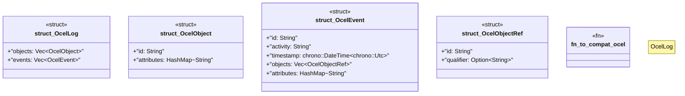

# `crates/ggen-graph/src/ocel/ocel_types.rs`

Source SHA-256: `9a73aad5be5c7c1a5eb2fa56aef8b162844d3502165df97e84e1e59a0cc22936`

## Dependencies

- `chrono::FixedOffset`
- `serde::{Deserialize, Serialize}`
- `std::collections::HashMap`
- `std::collections::HashSet`
- `wasm4pm_compat::ocel::{OCELEvent, OCELObject, OCELRelationship, OCELType, OCEL}`

## Standing

- Structural parse: `ALIVE`
- Runtime behavior: `UNKNOWN`
