# `crates/ggen-graph/src/ocel/pack_events.rs`

Source SHA-256: `d67c96a187719a034ab6cef10ef24649e7c849e7eb89c4a74eb7a083a135ae91`

```mermaid
classDiagram
    class fn_pack_object_id {
      <<fn>>
    }
    class fn_lockfile_entry_object_id {
      <<fn>>
    }
    class fn_receipt_object_id {
      <<fn>>
    }
    class fn_pack_object {
      <<fn>>
    }
    class fn_lockfile_entry_object {
      <<fn>>
    }
    class fn_receipt_object {
      <<fn>>
    }
    class fn_pack_subject_event {
      <<fn>>
    }
    class fn_emit_pack_install {
      <<fn>>
    }
    class fn_emit_pack_verify {
      <<fn>>
    }
    class fn_emit_pack_publish {
      <<fn>>
    }
    class fn_emit_pack_remove {
      <<fn>>
    }
    class fn_emit_lockfile_write {
      <<fn>>
    }
    class mod_tests {
      <<mod>>
    }
```

## Dependencies

- `chrono::{DateTime, Utc}`
- `chrono::{TimeZone, Utc}`
- `crate::ocel::{OcelEvent, OcelObject, OcelObjectRef}`
- `crate::ocel::{OcelLog, OcelObject}`
- `std::collections::HashMap`
- `super::*`

## Standing

- Structural parse: `ALIVE`
- Runtime behavior: `UNKNOWN`
