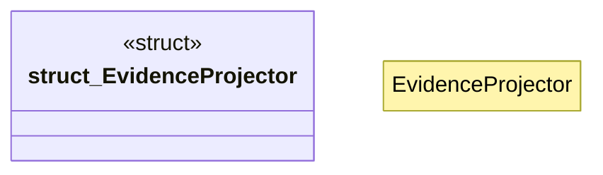

# `crates/ggen-graph/src/ocel/projection.rs`

Source SHA-256: `8489bd37eaa01694328cec5e693b9a8d7d6891bf9a93d7c3fabe29ce37716f98`

## Dependencies

- `crate::DeterministicGraph`
- `crate::GraphError`
- `crate::ocel::prov_types::ProvDerivation`
- `crate::ocel::{OcelEvent, OcelLog, OcelObject, OcelObjectRef}`
- `crate::ocel::{ProvActivity, ProvAgent, ProvDocument, ProvEntity, ProvGeneration, ProvUsage}`
- `oxigraph::model::{GraphName, Literal, NamedNode, NamedOrBlankNode, Quad, Term}`
- `std::collections::HashMap`

## Standing

- Structural parse: `ALIVE`
- Runtime behavior: `UNKNOWN`
