# `crates/ggen-graph/src/ocel/prov_types.rs`

Source SHA-256: `ebdfb8005e7d7869cbaf2e00964d8ce731195732369230e652beae1945600026`

```mermaid
classDiagram
    class struct_ProvDocument {
      <<struct>>
      +"entities: Vec~ProvEntity~"
      +"activities: Vec~ProvActivity~"
      +"agents: Vec~ProvAgent~"
      +"generations: Vec~ProvGeneration~"
      +"usages: Vec~ProvUsage~"
      +"derivations: Vec~ProvDerivation~"
    }
    class struct_ProvEntity {
      <<struct>>
      +"id: String"
      +"attributes: HashMap~String"
    }
    class struct_ProvActivity {
      <<struct>>
      +"id: String"
      +"start_time: Option~chrono::DateTime~chrono::Utc~~"
      +"end_time: Option~chrono::DateTime~chrono::Utc~~"
      +"attributes: HashMap~String"
    }
    class struct_ProvAgent {
      <<struct>>
      +"id: String"
      +"attributes: HashMap~String"
    }
    class struct_ProvGeneration {
      <<struct>>
      +"entity: String"
      +"activity: String"
    }
    class struct_ProvUsage {
      <<struct>>
      +"activity: String"
      +"entity: String"
    }
    class struct_ProvDerivation {
      <<struct>>
      +"generated_entity: String"
      +"used_entity: String"
    }
    note "ProvDocument"
```

## Dependencies

- `serde::{Deserialize, Serialize}`
- `std::collections::HashMap`

## Standing

- Structural parse: `ALIVE`
- Runtime behavior: `UNKNOWN`
