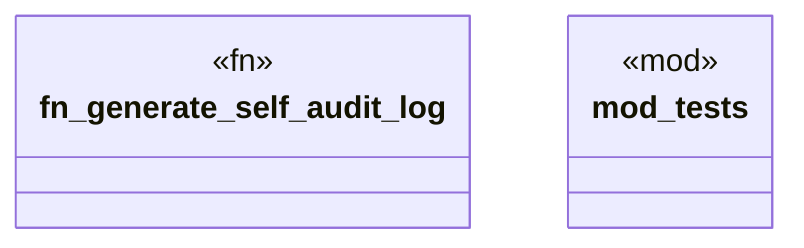

# `crates/ggen-graph/src/ocel/self_audit.rs`

Source SHA-256: `dde03e0129c3ad4e4f1467ced6603dae53b168890b462ecaf17c0dd51b50c63e`

## Dependencies

- `chrono::{TimeZone, Utc}`
- `crate::DeterministicGraph`
- `crate::ocel::EvidenceProjector`
- `crate::ocel::{OcelEvent, OcelLog, OcelObject, OcelObjectRef}`
- `std::collections::HashMap`
- `super::*`

## Standing

- Structural parse: `ALIVE`
- Runtime behavior: `UNKNOWN`
