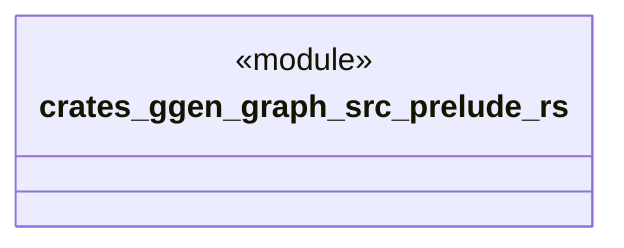

# `crates/ggen-graph/src/prelude.rs`

Source SHA-256: `c3fa85330d551c52c9ccb449b2178c73da1957c363b68bef180361b8c281078b`

## Dependencies

- `crate::delta::RdfDelta`
- `crate::graph::{ canonical::{sort_quads_canonically, to_canonical_nquads_string}, hash::{hash_delta, hash_quads}, introspect::{iri_terms, IriTerms}, locate::{ extract_prefixes, parse_nquads_located, parse_ntriples_located, parse_turtle_located, LocatedParse, ParseDiagnostic, }, parse::{parse_from_reader, parse_nquads, parse_ntriples, parse_turtle}, quad::QuadBuilder, serialize::{serialize_to_string, serialize_to_writer}, DeterministicGraph, KnowledgeHook, TransitionReceipt, }`
- `crate::receipt::{GraphReceipt, HookReceipt, ReplayVerifier, TransactionBundle}`
- `crate::shacl::{validate_shacl, ShaclSeverity, ShaclViolation}`
- `crate::vocab`

## Standing

- Structural parse: `ALIVE`
- Runtime behavior: `UNKNOWN`
