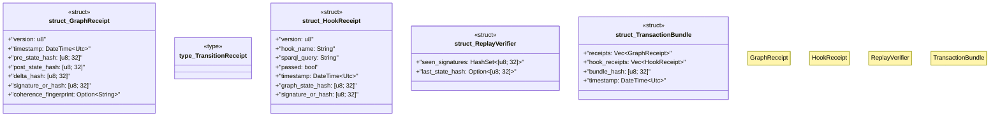

# `crates/ggen-graph/src/receipt/mod.rs`

Source SHA-256: `46205f5f3e5bb55f460e910ba8aaf939e9e9477792655b58ae6d6af1c345feb5`

## Dependencies

- `chrono::{DateTime, Utc}`
- `crate::GraphError`
- `crate::coherence::CoherenceReport`
- `serde::{Deserialize, Serialize}`
- `std::collections::HashSet`

## Standing

- Structural parse: `ALIVE`
- Runtime behavior: `UNKNOWN`
