# `crates/ggen-graph/src/rwr/automatic.rs`

Source SHA-256: `e8e9f8cab826c92f9015997f667706c8a112eb9f733b061a7501e7dde5625353`

```mermaid
classDiagram
    class fn_put_len_prefixed {
      <<fn>>
    }
    class fn_safe_token {
      <<fn>>
    }
    class fn_safe_action_id {
      <<fn>>
    }
    class enum_OperationsCapability {
      <<enum>>
    }
    class enum_OperationsProofSurface {
      <<enum>>
    }
    class struct_Trigger {
      <<struct>>
      +"id: String"
      +"kind: String"
      +"sequence: u64"
      +"payload: Vec~u8~"
      +"expected_payload_digest: [u8; 32]"
    }
    class struct_TriggerAdmissionPolicy {
      <<struct>>
      +"allowed_kinds: BTreeSet~String~"
      +"max_payload_bytes: usize"
      +"max_sequence: u64"
    }
    class struct_AdmittedTrigger {
      <<struct>>
      +"trigger: Trigger"
      +"trigger_digest: [u8; 32]"
    }
    class struct_Route {
      <<struct>>
      +"trigger_kind: String"
      +"dimension: Dimension"
      +"intent_name: String"
    }
    class struct_TriggerRouter {
      <<struct>>
      +"routes: BTreeMap~String"
    }
    class struct_ManufacturedIntent {
      <<struct>>
      +"id: String"
      +"trigger_digest: [u8; 32]"
      +"route_digest: [u8; 32]"
      +"dimension: Dimension"
      +"desired_state: Vec~u8~"
      +"inverse_state: Option~Vec~u8~~"
      +"intent_digest: [u8; 32]"
    }
    class fn_intent_digest {
      <<fn>>
    }
    class enum_AndonLevel {
      <<enum>>
    }
    class struct_AndonSignal {
      <<struct>>
      +"level: AndonLevel"
    }
    class struct_RetryPolicy {
      <<struct>>
      +"max_attempts: u8"
      +"base_backoff_ticks: u64"
    }
    class struct_CircuitBreaker {
      <<struct>>
      +"failure_threshold: u32"
      +"consecutive_failures: u32"
      +"open: bool"
    }
    class struct_ErrorBudget {
      <<struct>>
      +"remaining_units: u64"
      +"cost_per_operation: u64"
    }
    class struct_OperationsGovernor {
      <<struct>>
      +"andon: AndonSignal"
      +"retry: RetryPolicy"
      +"circuit_breaker: CircuitBreaker"
      +"error_budget: ErrorBudget"
    }
    class enum_ObservationError {
      <<enum>>
    }
    class trait_ConsequenceObserver {
      <<trait>>
      +"observe(
        &mut self, actuator: &FilesystemActuator, receipt: &ActuationReceipt,
    ) -~ Result~Vec~u8~, ObservationError~"
    }
    class struct_FilesystemConsequenceObserver {
      <<struct>>
    }
    class struct_KnowledgeHook {
      <<struct>>
      +"schema: String"
      +"topic: String"
      +"cause_receipt_digest: [u8; 32]"
      +"consequence_digest: [u8; 32]"
      +"hook_digest: [u8; 32]"
    }
    class fn_hook_digest {
      <<fn>>
    }
    class struct_AutomaticOperationReceipt {
      <<struct>>
      +"schema: String"
      +"operations_version: String"
      +"trigger_digest: [u8; 32]"
      +"route_digest: [u8; 32]"
      +"intent_digest: [u8; 32]"
      +"grant_digest: [u8; 32]"
      +"actuation_receipt: ActuationReceipt"
      +"consequence_digest: [u8; 32]"
      +"observation_attempts: u8"
      +"logical_backoff_ticks: u64"
      +"predecessor_receipt_digest: Option~[u8; 32]~"
      +"knowledge_hook: KnowledgeHook"
      +"receipt_digest: [u8; 32]"
    }
    class fn_automatic_receipt_digest {
      <<fn>>
    }
    class struct_PostconditionFailure {
      <<struct>>
      +"attempts: u8"
      +"logical_backoff_ticks: u64"
      +"last_observed_digest: Option~[u8; 32]~"
      +"rollback_receipt: Option~ActuationReceipt~"
    }
    class struct_AutomaticRuntime {
      <<struct>>
      +"admission: TriggerAdmissionPolicy"
      +"router: TriggerRouter"
      +"governor: OperationsGovernor"
      +"seen_triggers: BTreeSet~[u8; 32]~"
      +"predecessor_receipt_digest: Option~[u8; 32]~"
    }
    class struct_AutomaticReplayVerifier {
      <<struct>>
      +"seen: BTreeSet~[u8; 32]~"
    }
    class struct_AutonomicResource {
      <<struct>>
      +"id: String"
      +"desired_state: Vec~u8~"
      +"current_action_id: String"
      +"repair_trigger_kind: String"
    }
    class struct_AutonomicOperationsReceipt {
      <<struct>>
      +"schema: String"
      +"resource_id: String"
      +"initial_state_digest: [u8; 32]"
      +"final_state_digest: [u8; 32]"
      +"cycles: u8"
      +"operations: Vec~AutomaticOperationReceipt~"
      +"knowledge_digest: [u8; 32]"
      +"converged: bool"
      +"receipt_digest: [u8; 32]"
    }
    class fn_autonomic_knowledge_digest {
      <<fn>>
    }
    class fn_autonomic_operations_digest {
      <<fn>>
    }
    class struct_AutonomicOperationsController {
      <<struct>>
      +"max_cycles: u8"
    }
    class fn_read_committed_payload {
      <<fn>>
    }
    class enum_OperationsError {
      <<enum>>
    }
    note "AndonSignal"
    note "AutomaticOperationReceipt"
    note "AutomaticReplayVerifier"
    note "AutomaticRuntime"
    note "AutonomicOperationsController"
    note "AutonomicOperationsReceipt"
    note "AutonomicResource"
    note "CircuitBreaker"
    note "ConsequenceObserver for FilesystemConsequenceObserver"
    note "Default for AndonSignal"
    note "ErrorBudget"
    note "KnowledgeHook"
    note "ManufacturedIntent"
    note "OperationsGovernor"
    note "RetryPolicy"
    note "Route"
    note "Trigger"
    note "TriggerAdmissionPolicy"
    note "TriggerRouter"
```

## Dependencies

- `crate::rwr::execution::{ Action, ActuationReceipt, ExecutionError, FilesystemActuator, FoundationMachine, }`
- `crate::rwr::matrix::Dimension`
- `serde::{Deserialize, Serialize}`
- `std::collections::{BTreeMap, BTreeSet}`
- `std::fs::File`
- `std::io::Read`

## Standing

- Structural parse: `ALIVE`
- Runtime behavior: `UNKNOWN`
