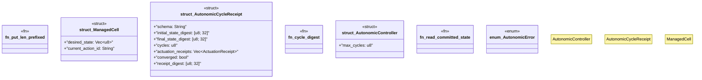

# `crates/ggen-graph/src/rwr/autonomic.rs`

Source SHA-256: `d52e5a6dd128b26e2cc63e9c2e1cc123acd3a487acb0b1b3b6b55ea5441ba36a`

## Dependencies

- `crate::rwr::execution::{ Action, ActuationReceipt, ExecutionError, FilesystemActuator, FoundationMachine, }`
- `crate::rwr::matrix::Dimension`
- `serde::{Deserialize, Serialize}`
- `std::fs::File`
- `std::io::Read`

## Standing

- Structural parse: `ALIVE`
- Runtime behavior: `UNKNOWN`
