# `crates/ggen-graph/src/rwr/evidence.rs`

Source SHA-256: `2efde8143e5d1efa7739042031afd6dd12fe41ae5427e6f37c9236151373e01c`

```mermaid
classDiagram
    class enum_GallState {
      <<enum>>
    }
    class enum_EvidenceOutcome {
      <<enum>>
    }
    class struct_EvidenceRecord {
      <<struct>>
      +"id: String"
      +"dimension: Dimension"
      +"level: MaturityLevel"
      +"surface: EvidenceSurface"
      +"outcome: EvidenceOutcome"
      +"source: String"
      +"epoch: u64"
      +"artifact_digest: [u8; 32]"
      +"observation_digest: [u8; 32]"
    }
    class fn_put {
      <<fn>>
    }
    class fn_observation_digest {
      <<fn>>
    }
    class enum_EvidenceError {
      <<enum>>
    }
    class struct_EvidenceLedger {
      <<struct>>
      +"records: Vec~EvidenceRecord~"
    }
    class fn_attained_level {
      <<fn>>
    }
    class fn_dimension_standing {
      <<fn>>
    }
    class fn_overall_standing {
      <<fn>>
    }
    class struct_DimensionAssessment {
      <<struct>>
      +"dimension: Dimension"
      +"attained_level: Option~MaturityLevel~"
      +"standing: GallState"
      +"satisfied_surfaces: Vec~EvidenceSurface~"
      +"missing_surfaces: Vec~EvidenceSurface~"
      +"blocking_evidence: Vec~String~"
    }
    class struct_MaturityAssessment {
      <<struct>>
      +"matrix_version: String"
      +"evidence_root: [u8; 32]"
      +"standing: GallState"
      +"dimensions: Vec~DimensionAssessment~"
    }
    class struct_AssessmentReceipt {
      <<struct>>
      +"schema: String"
      +"assessment: MaturityAssessment"
      +"receipt_digest: [u8; 32]"
    }
    class fn_assessment_digest {
      <<fn>>
    }
    note "AssessmentReceipt"
    note "EvidenceLedger"
    note "EvidenceRecord"
    note "MaturityAssessment"
```

## Dependencies

- `crate::rwr::matrix::{ contract, Dimension, EvidenceSurface, MaturityLevel, ALL_DIMENSIONS, MATRIX_VERSION, }`
- `serde::{Deserialize, Serialize}`
- `std::collections::{BTreeMap, BTreeSet, HashSet}`

## Standing

- Structural parse: `ALIVE`
- Runtime behavior: `UNKNOWN`
