# `crates/ggen-graph/src/rwr/execution.rs`

Source SHA-256: `d9e2880288ebd3079a8c906516934bee6a767e1fbe9df2db53d60323bf2f1f63`

```mermaid
classDiagram
    class fn_put_len_prefixed {
      <<fn>>
    }
    class struct_Action {
      <<struct>>
      +"id: String"
      +"dimension: Dimension"
      +"payload: Vec~u8~"
      +"expected_payload_digest: [u8; 32]"
    }
    class fn_is_safe_id {
      <<fn>>
    }
    class struct_ExecutionPolicy {
      <<struct>>
      +"allowed_dimensions: BTreeSet~Dimension~"
      +"max_payload_bytes: usize"
    }
    class struct_ExecutionGrant {
      <<struct>>
      +"schema: String"
      +"action_digest: [u8; 32]"
      +"matrix_version: String"
      +"grant_digest: [u8; 32]"
    }
    class fn_grant_digest {
      <<fn>>
    }
    class struct_FoundationMachine {
      <<struct>>
      +"policy: ExecutionPolicy"
    }
    class struct_ActuationReceipt {
      <<struct>>
      +"schema: String"
      +"action_id: String"
      +"dimension: Dimension"
      +"artifact_path: String"
      +"payload_digest: [u8; 32]"
      +"grant_digest: [u8; 32]"
      +"receipt_digest: [u8; 32]"
    }
    class fn_actuation_receipt_digest {
      <<fn>>
    }
    class struct_FilesystemActuator {
      <<struct>>
      +"root: PathBuf"
    }
    class struct_ReplayVerifier {
      <<struct>>
      +"seen: BTreeSet~[u8; 32]~"
    }
    class enum_ExecutionError {
      <<enum>>
    }
    note "Action"
    note "ActuationReceipt"
    note "ExecutionGrant"
    note "ExecutionPolicy"
    note "FilesystemActuator"
    note "FoundationMachine"
    note "ReplayVerifier"
```

## Dependencies

- `crate::rwr::matrix::{Dimension, ALL_DIMENSIONS, MATRIX_VERSION}`
- `serde::{Deserialize, Serialize}`
- `std::collections::BTreeSet`
- `std::fs::{self, File}`
- `std::io::{Read, Write}`
- `std::path::{Path, PathBuf}`

## Standing

- Structural parse: `ALIVE`
- Runtime behavior: `UNKNOWN`
