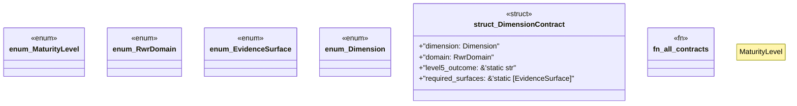

# `crates/ggen-graph/src/rwr/matrix.rs`

Source SHA-256: `fdfc769038a5c700492683ec0b6b605bb0c0e6db69f7d0efd46309842a3fd8d5`

## Dependencies

- `Dimension as D`
- `EvidenceSurface as S`
- `RwrDomain as R`
- `serde::{Deserialize, Serialize}`

## Standing

- Structural parse: `ALIVE`
- Runtime behavior: `UNKNOWN`
