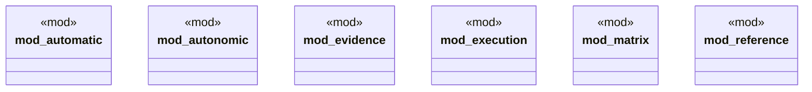

# `crates/ggen-graph/src/rwr/mod.rs`

Source SHA-256: `877ec087a38b4127c64b6753b23f0a3cdf123359a028fdc7d1d09d90e2fef649`

## Dependencies

- `automatic::{ read_committed_payload, AdmittedTrigger, AndonLevel, AndonSignal, AutomaticOperationReceipt, AutomaticReplayVerifier, AutomaticRuntime, AutonomicOperationsController, AutonomicOperationsReceipt, AutonomicResource, CircuitBreaker, ConsequenceObserver, ErrorBudget, FilesystemConsequenceObserver, KnowledgeHook, ManufacturedIntent, ObservationError, OperationsCapability, OperationsError, OperationsGovernor, OperationsProofSurface, PostconditionFailure, RetryPolicy, Route, Trigger, TriggerAdmissionPolicy, TriggerRouter, ALL_OPERATIONS_CAPABILITIES, OPERATIONS_VERSION, REQUIRED_OPERATIONS_PROOF_SURFACES, }`
- `autonomic::{AutonomicController, AutonomicCycleReceipt, AutonomicError, ManagedCell}`
- `evidence::{ AssessmentReceipt, DimensionAssessment, EvidenceError, EvidenceLedger, EvidenceOutcome, EvidenceRecord, GallState, MaturityAssessment, }`
- `execution::{ Action, ActuationReceipt, ExecutionError, ExecutionGrant, ExecutionPolicy, FilesystemActuator, FoundationMachine, ReplayVerifier, }`
- `matrix::{ all_contracts, contract, Dimension, DimensionContract, EvidenceSurface, MaturityLevel, RwrDomain, ALL_DIMENSIONS, MATRIX_VERSION, }`
- `reference::{ReferenceError, ReferenceFoundation, ReferenceProof}`

## Standing

- Structural parse: `ALIVE`
- Runtime behavior: `UNKNOWN`
